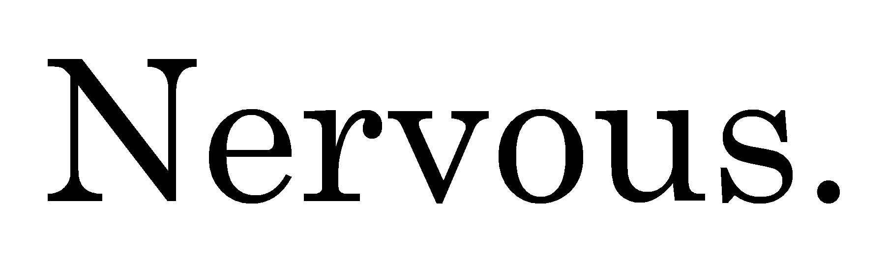
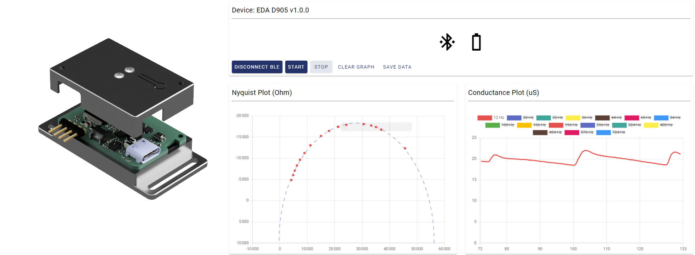

<p align="center">
    
</p>
<p align="center">
    <h1 align="center">Nervous EDA Sensor</h1>
</p>

<p align="center">
    <a href="https://github.com/sensors-inl/Nervous-ECG/releases/"></a>
    <a href="https://github.com/sensors-inl/Nervous-ECG/releases/"></a>
	
	<a href="https://opensource.org/licenses/MIT"></a>
</p>

## Table of Contents

- [Table of Contents](#table-of-contents)
- [Overview](#overview)
- [Description](#description)
- [Features](#features)
- [Instructions](#instructions)
- [Releases](#releases)
- [Contributing](#contributing)
- [Contact](#contact)
- [License](#license)
- [Acknowledgments](#acknowledgments)

---

## Overview

The **Nervous** project is an initiative based on open-hardware and open-source principles, aimed at providing wearable sensors and software for analyzing the Autonomic Nervous System (ANS) activity.

The **Nervous EDA** project is part of the **[Nervous Toolkit](https://github.com/sensors-inl/Nervous-Toolkit)** and includes hardware design files and firmware source files for creating an electrodermal activity (EDA) sensor.
The device is wireless and transmits the collected data via Bluetooth Low Energy.



This EDA sensor uses continuous multifrequency impedance spectroscopy to measure skin conductivity at 16 simultaneous frequencies with a rate of 8 spectra per second.
The method is fully described detailed in [B. Massot, E. Desmazure, A. Montalibet, E. McAdams and C. Gehin, "A Portable Device Performing Continuous Impedance Spectroscopy for Skin Conductivity," in IEEE Sensors Journal, doi: 10.1109/JSEN.2024.3485187](https://ieeexplore.ieee.org/document/10738317).
The embedded electronic circuit employs two microcontrollers.
The first one is a PSoC Analog co-processor (Infineon) for analog signal generation and conditioning.
The second one is an ISP1807 (Insight SiP) which houses a nRF52840 (Nordic Semiconductor) for voltage and current sampling, impedance calculation and Bluetooth Low Energy communication.

---

## Description

This EDA sensor uses continuous multifrequency impedance spectroscopy to measure skin conductivity at 16 simultaneous frequencies with a rate of 8 spectra per second.
The method is fully described detailed in [B. Massot, E. Desmazure, A. Montalibet, E. McAdams and C. Gehin, "A Portable Device Performing Continuous Impedance Spectroscopy for Skin Conductivity," in IEEE Sensors Journal, doi: 10.1109/JSEN.2024.3485187](https://ieeexplore.ieee.org/document/10738317).
The embedded electronic circuit employs two microcontrollers.
The first one is a PSoC Analog co-processor (Infineon) for analog signal generation and conditioning.
The second one is an ISP1807 (Insight SiP) which houses a nRF52840 (Nordic Semiconductor) for voltage and current sampling, impedance calculation and Bluetooth Low Energy communication.

---

## Features

This project is actually a collection of three sub-projects for the sensor design, located in the following directories:

[hardware](./hardware/): This folder contains ECAD files for producing PCBs and assembling circuits for a wireless wrist-worn EDA sensor.
A archive (.zip) containing the design and manufacturing/assembly files for the sensor is available in the releases of this project.

[firmware](./firmware/): This folder contains source files to build binaries for programming both microcontrollers.
Precompiled binaries are also provided in the releases of this project.

[web-app](./web-app/): While the sensor is primarily designed to work with the [```nervous-sensors```](https://github.com/sensors-inl/Nervous-Sensors) Python package included in the Nervous Toolkit, a standalone web application is provided for simplified use of the sensor.
It offers sensor control, real-time data visualization, and recording features.
Pre-built executables for both Microsoft Windows and Linux are also available in the releases of this project.

---

## Instructions

Detailed instructions are provided in each subdirectory for manufacturing, programming, and using the sensor.

---

## Releases

Each [release](https://github.com/sensors-inl/Nervous-ECG/releases/latest) contains built firmware and application binaries as well as an archive of ECAD files.

---

## Contributing

Contributions are what make the open-source community such a great place to learn, inspire, and create. Any contributions you make are greatly appreciated. You can open an issue to report a bug, request a feature, or submit a pull request.

We especially welcome contributions to port the nRF52 firmware from nRF5 SDK to nRF Connect SDK, which requires expertise with the `nrfx` library inside Zephyr.

---

## Contact

Bertrand MASSOT - [bertrand.massot@insa-lyon.fr](mailto:bertrand.massot@insa-lyon.fr)

---

## License

This project, along with the entire Nervous initiative, is licensed under the [MIT License](https://opensource.org/licenses/MIT). For more details, see the [License](LICENSE.md) file.

---

## Acknowledgments

The main contributors to this project are Bertrand Massot, Matthieu Mesnage, Tristan Habemont and Hugo Buy from INSA Lyon, CNRS, INL UMR 5270, Villeurbanne, France.

This work was supported by the **French National Research Agency (ANR)** under grant **ANR-22-CE31-0023-03 RENFORCE**.

---
