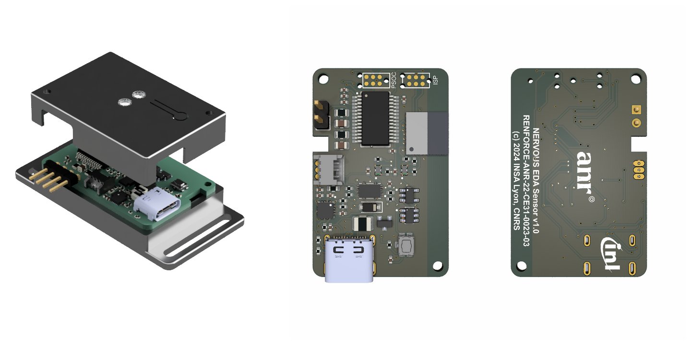
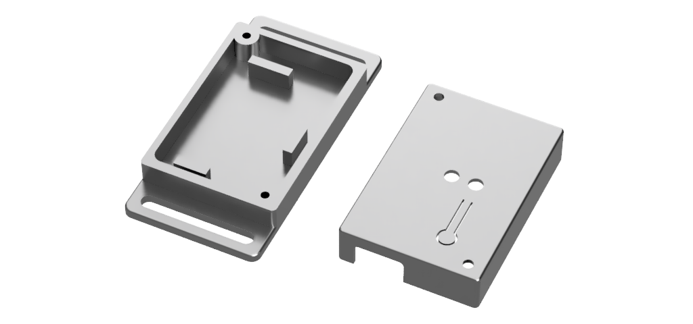

    <h1 align="center">Nervous EDA Hardware</h1>

    
    

## Table of Contents

- [Table of Contents](#table-of-contents)
- [Overview](#overview)
- [Hardware features](#hardware-features)
- [Manufacturing and assembling](#manufacturing-and-assembling)
  - [PCB properties for manufacturing](#pcb-properties-for-manufacturing)
- [Modification](#modification)
- [Casing](#casing)
- [Note on cables and electrodes placement](#note-on-cables-and-electrodes-placement)
- [Release](#release)

---

## Overview

This folder contains ECAD files for the production of PCBs and assembly of circuits for the Nervous EDA sensor.
The printed circuit board was designed using the open source electronics design automation suite [KiCad EDA](https://www.kicad.org/) v9.0.0

---

## Hardware features

- USB-C connector for charging the battery
- Embedded LiPo battery charger and I2C fuel gauge
- On/Off SPST button (enables/disables the voltage regulator)
- RGB status LED
- CY8C4A45PVI-481 Programmable-System-On-Chip for impedance spectroscopy
- nRF52840 (ISP1807) with Bluetooth Low Energy

---

## Manufacturing and assembling

The following files are available in the `Export` folder:

- **Export/Manufacturing**: contains Gerber (.gbr) and drill files (.drl)
- **Export/Assembly**: contains assembly drawing (.pdf), pick and place files (.pos), and BOM (.csv)

---

### PCB properties for manufacturing

Some PCB manufacturers may require the following properties. The table below summarizes the principal PCB properties:

| Property                    | Value              |
| --------------------------- | ------------------ |
| Dimensions                  | 21.5 mm x 33.5 mm  |
| Number of layers            | 2                  |
| Minimal insulation width    | 0.150 mm           |
| Minimal trace width         | 0.150 mm           |
| Minimal hole size           | 0.200 mm           |

---

## Modification

The `Source` folder contains the original KiCad project, created using KiCad version 7.0.8.

---

## Casing

Several 3D models are available for producing a casing for the electronics. STEP and STL files are located in the `Casing` folder:

- **casing_top** and **casing_bottom** are two parts that assemble together with two M2 screws, where the PCB and a 150 mAh LiPo battery fit. A specially designed battery compartment ensures that it does not overlap with the antenna of the ISAP1807 chip located on the longitudinal edge of the PCB. The design of the bottom part includes handles for wrist attachment.
- **casing_bottom_controller** is a modified version of the bottom part, designed to mount the electronics circuit and battery onto a Valve Index controller for ECG assessment during virtual environment sessions.

---

## Note on cables and electrodes placement

This sensor is designed to capture skin conductivity across two electrodes.
For connectivity, we implemented a simple 2.54 mm, 2-way header on the sensor, allowing for custom electrode connections.
It's advised to use short cables for connecting the two electrodes in proximity to the device.

We recommend using solid-gel electrodes such as Ambu&reg; WhiteSensor 40713 with an initial wear period of 10 minutes before starting measurements.
We constructed cables featuring female crimp terminals on the sensor end and 3 mm banana plugs with a snap adapter on the electrode end.
Finally, securely hold the electrodes in place, along with the cables near the electrodes, using medical tape to minimize noise from connector friction.

---

## Release

The entire folder is provided as an archive (`Nervous-EDA-hardware-vX.X.X.zip`) in the [releases](https://github.com/sensors-inl/Nervous-EDA/releases/latest) of this project.

---
